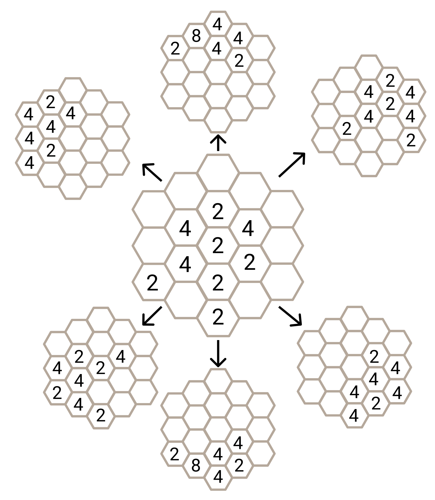
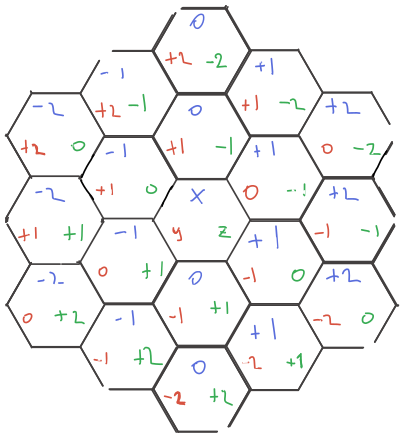

# Hexagonal 2048

## Task description

Your task is to develop game [2048](https://play2048.co/) on hexagonal field.
Please take a look our example: [hexagonal 2048](http://hex2048.surge.sh/).

What is required:

- Have to render a game hexagonal field with hexagons according to the game
  size.
- Required game size is 2. Existence of other game levels (3, 4, ...) is highly
  appreciated but NOT REQUIRED.
- Have to receive data from the
  [server](#receiving-data-from-the-deployed-server) and render them correctly.
- Have to handle appropriate keyboard keys according to the
  [rules](#directions-and-keys).
- Have to change field data by clicking keyboard keys according to the
  [rules](#shifting-rules).
- Deploy your implementation on the Internet (free resources:
  [gh-pages](https://pages.github.com/), [surge](http://surge.sh),
  [netlify](http://netlify.com), [vercel](https://vercel.com))
- Have to work on the latest Google Chrome on the desktop (all other devices and
  browsers are up to you).
- All other ideas, game features and controls, supported devices and so on are
  optional.

Nice to have:

- Several game levels (at least 3 and 4) ([example](http://hex2048.surge.sh/)).

More info:

- **Please join the [chat](https://gitter.im/evolution-ts-bootcamp/community) and
  do not be shy to ask any questions what you have. We are glad to do our best
  to clarify unclear things, add more details regarding the home task or tests
  and help you.**
- **Useful article about hexagons:
  [Hexagonal Grids](https://www.redblobgames.com/grids/hexagons/).**
- The visual game appearance and technologies to implement the task are up to
  you and are restricted only your imagination.
- Animations are appreciated but not required.

**Please follow the news in the [chat](https://gitter.im/evolution-ts-bootcamp/community)**

## Rules

### Game initialization

When the game starts on any game level, the first action from the user is not
expected. That means when you choose the game level or the game is loaded, the
game should be initialized on its own by default, and the user has to see the
beginning numbers to start playing.

The same rule is applicable when the game is loaded by the URL for
[tests purposes](#how-will-your-solution-be-tested). When the game was loaded by
the URL, the first request has to be done immediately after loading without any
additional actions. And as a result, you will be able to see the beginning
numbers to start playing.

In other words, before starting playing the user should already see some
beginning numbers received from the server without any actions. The first
request to the server has to be done automatically after starting the game.

### Directions and Keys

You have 6 keyboard keys (latin lower case letters) for 6 existing directions:

| Direction                 | Keyboard key |
| ------------------------- | :----------: |
| north (top)               |      W       |
| north-east (top-right)    |      E       |
| north-west (top-left)     |      Q       |
| south (bottom)            |      S       |
| south-east (bottom-right) |      D       |
| south-west (bottom-left)  |      A       |

After pressing any of the listed keys, all your numbers should be shifted in the
chosen direction.

### Shifting rules

Shifting works according to common [2048](https://play2048.co/) rules
([RU](<https://ru.wikipedia.org/wiki/2048_(%D0%B8%D0%B3%D1%80%D0%B0)>) |
[EN](<https://en.wikipedia.org/wiki/2048_(video_game)>)) taking into account
appropriate hexagonal direction.

| before shift → |   after |
| -------------: | ------: |
|            2 2 |       4 |
|          2 2 2 |     2 4 |
|        2 4 2 4 | 2 4 2 4 |
|        2 2 4 4 |     4 8 |



After each shift, you need to place new numbers received from the
[server](#rng-server).

In case if after starting shifting there are not movements done in the chosen
direction and there are possible movements at least in one direction
([game status](#game-status) is `playing`), nothing should be done until
shifting is completed - do not need to add new numbers. The game has to wait for
changes in any direction if they are possible and has not been done during
shifting.

### Game status

The game should know a current game status.

Possible game statuses:

- `playing` - there are possible moves that can be done.
- `game-over` - there are no more possible moves.

Game status should be present somewhere in your game DOM element (any one DOM
element at the any place of DOM) as a data attribute `data-status`. Example:

```html
<div>Game Status: <span data-status="playing">playing</span></div>
```

## RNG Server

## Receiving data from the deployed server

For the game purposes, we have a
[random number generator](https://en.wikipedia.org/wiki/Random_number_generation)
(RNG) server that generates random numbers into random places for your field.

The server expects you to send a POST request with correct body and pathname in
the URL. Body has to be an array of non-empty cells (the number should be 2 and
more) of your field. Cells order doesn't matter. A cell is an object which is a
representation of
[cube coordinates](https://www.redblobgames.com/grids/hexagons/#coordinates-cube).
For example:

```js
const cell = {
  x: 0,
  y: 1,
  z: -1,
  value: 2,
}
```

The server responds with array of the
[cube coordinates](https://www.redblobgames.com/grids/hexagons/#coordinates-cube)
cells that you need to add into your field. The servers sends an empty array in
case of no more positions to add a new numbers. `x`, `y`, `z` are positions for
new numbers. `value` is a number to add at that position.



The server expects you to send the radius (game level) in the URL pathname
(e.g., `/2` for 2, `/3` for 3, etc.). For example, correct server URL for game
radius 2 is `//68f02c80-3bed-4e10-a747-4ff774ae905a.pub.instances.scw.cloud/2`.

Server URL: `68f02c80-3bed-4e10-a747-4ff774ae905a.pub.instances.scw.cloud`
(works with both HTTP and HTTPS).

Example (initial game):

```bash
curl -d '[]' \
     -X POST http://68f02c80-3bed-4e10-a747-4ff774ae905a.pub.instances.scw.cloud/2
```

Or

```bash
curl -d '[]' \
     -X POST https://68f02c80-3bed-4e10-a747-4ff774ae905a.pub.instances.scw.cloud/2
```

Server response:

```
[
  { "x": 0, "y": 1, "z": -1, "value": 2},
  { "x": 1, "y": 0, "z": -1, "value": 2},
  { "x": 1, "y": -1, "z":  0, "value": 2}
]
```

Example with payload (filled cells):

```bash
curl -d '[{"x": 0, "y": 0, "z": 0, "value": 2}]' \
     -X POST http://68f02c80-3bed-4e10-a747-4ff774ae905a.pub.instances.scw.cloud/2
```

Or

```bash
curl -d '[{"x": 0, "y": 0, "z": 0, "value": 2}]' \
     -X POST https://68f02c80-3bed-4e10-a747-4ff774ae905a.pub.instances.scw.cloud/2
```

Server response:

```
[ { "x": 1, "y": -1, "z": 0, "value": 2 } ]
```

### Receiving data from the local server

To start the server locally you should clone **this repository**, go to the
`typescript-bootcamp/assigment/hex2048` folder, install dependencies and run
tests. Steps to help:

```
git clone https://github.com/evolution-gaming/typescript-bootcamp.git
cd typescript-bootcamp/assigment/hex2048
npm install
npm run rng-server
```

Server URL: `http://localhost`.

Server port: `13337`.

Example:

```bash
curl -d '[{"x": 0, "y": 0, "z": 0, "value": 2}]' \
     -X POST http://localhost:13337/2
```

Server response:

```
[ { "x": 1, "y": -1, "z": 0, "value": 2 } ]
```

## How will your solution be tested?

### Data attributes for hexagons

Every cell from the field should have appropriate data attributes: `data-x`,
`data-y`, `data-z` and `data-value`. Where `data-x`, `data-y`, `data-z` are
respective representations of cube coordinates `x`, `y`, `z`. And `data-value`
is number into this cell (e.g., 2, 4, 8, etc. or 0 if there is no number yet).

Example:

```html
<div data-x="1" data-y="-1" data-z="0" data-value="8">8</div>
<div data-x="1" data-y="-1" data-z="0" data-value="0"></div>
```

The element in the DOM with unique combination of `data-x`, `data-y`, `data-z`
has to be a single one and has to have appropriate `data-value`. That means you
should not have more than one element in the DOM with same values of `data-x`,
`data-y`, `data-z`. Otherwise, tests cannot handle this properly.

### Data attribute to recognize game status

Do not forget to add `data-status` attribute. [Read more](#game-status)

### Select the server URL

The game has to have a selector to choose a server URL. This is necessary in
terms of game testing.

Please, add appropriate HTML code in your game and handle selection correctly.
For example:

```html
<select id="url-server">
  <option id="remote" value="//68f02c80-3bed-4e10-a747-4ff774ae905a.pub.instances.scw.cloud">Remote server</option>
  <option id="localhost" value="http://localhost:13337/">Local server</option>
</select>
```

Pay attention to appropriate ids:
- `id="url-server"` for `select`
- `id="localhost"` for `option` to receive data from localhost
- `id="remote"` for `option` to receive data from our deployed server

The elements with these ids should be unique across all the DOM. Otherwise,
tests cannot handle this properly.

After switching between the options, the game has to receive data from the
chosen URL starting the game from scratch.

### Hash in the URL

Your game should recognize hash in the URL (to run a correct game level for
tests):

- `/#test2` - where your application will start the game with radius 2
- `/#test3` - with radius 3
- `/#test4` - with radius 4

Example:

- http://hex2048.surge.sh/ - a game link
- http://hex2048.surge.sh/#test2 - the link that automatically starts a game
  with radius 2
- http://hex2048.surge.sh/#test3 - the link that automatically starts a game
  with radius 3

**Do not forget to refer to our [example](http://hex2048.surge.sh/) to check how
elements should be marked in DOM.**

### Run tests locally

To run tests locally you should clone **this repository**, go to the
`typescript-bootcamp/assigment/hex2048` folder, install dependencies and run
tests. Steps to help:

```
git clone https://github.com/evolution-gaming/typescript-bootcamp.git
cd typescript-bootcamp/assigment/hex2048
npm install
npm run test-game
```

Local tests expect that your game receives the data by the URL
`http://localhost:13337/` in order to mock responses with test data. Please be
careful when you run tests and do not forgot to change the URL. Tests do it
automatically according to [these rules](#select-the-server-url).

By default, the server connects to `http://localhost:8080` in order to open the
game but you can change this behavior by passing `url` parameter. Example:

```
npm run test-game -- --url=http://localhost:3000
```

Please run tests for your deployed game and check that all work properly. 

```
npm run test-game -- --url=http://hex2048.surge.sh
```

## Grading Notes

For extra credits, you should the following (one or more):

- Support radiuses more than 2 (at least 3, 4 and even more)
- Cover your code base with unit tests (with a common sense of course)
- Implement animations

## Task submission

Please publish the solution in a private [GitHub](https://github.com/)
repository and give user [@evo-home-task](https://github.com/evo-home-task)
access to the repository.

Share the link with your deployed version via email or better add it into README
in your github repository with your solution.

## Feedback

**You can address any questions by email or ask in the
[chat](https://gitter.im/evolution-ts-bootcamp/community)**
