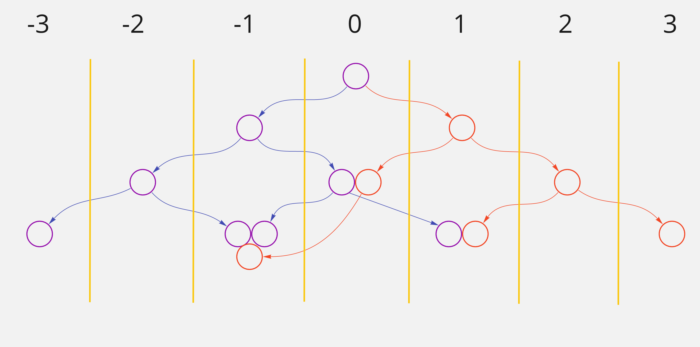

# Data Structure

**Deadline: 25.04.2021 23:59 Minsk**

## Task description

Your task is to develop several **data structure** algorithms.

What is required:

- Implement `BinaryTree` interface.
- Develop `BinaryTree` class that implements `BinaryTree` interface.
- `BinaryTree` class has to be generic and able to define a node value.
- Implement `BinarySearchTree` interface that extends `BinaryTree` interface.
- Develop `BinarySearchTree` class that implements `BinarySearchTree` interface
  and extends `BinaryTree` class.
- `BinarySearchTree` class has to have a numeric node value (not a generic class).
- Develop the `mergeSort` function.
- Cover all the code with tests (via `jest`). Coverage has to be 100%.
- **DO NOT FORGET to define all types and access modifiers where needed**.

Overall, it is required to implement the TypeScript project with data structure
algorithms covered with tests.

Any visualization of the algorithms is not required, but if you have strong
willingness to use React and implement your ideas, you are always welcome.
It is only appreciated any ideas in that direction.

### Binary Search Tree requirements

Pseudo-interfaces of `BinaryTree` and `TreeNode`:

```
TreeNode {
    value: TreeNodeValue;
    left: TreeNode;
    right: TreeNode;
}

BinaryTree {
    constructor(tree: TreeNode): void;

    setTree(tree: TreeNode): this;

    // Depth-First Search (DFS) - inorder, preorder, postorder
    // Breadth-First Search (BFS) - breadth
    traverse(traverseType): TreeNodeValue[];

    getColumn(columnOrder: number): TreeNodeValue[];
}
```

Pseudo-interface of `BinarySearchTree`:

```
BinarySearchTree extends BinaryTree<number> {
    has(value: number): boolean;
}
```

`TreeNode` has to be a generic interface.

`traverseType` has to be an enum with 4 values (3 of DFS and 1 of BFS).

`setTree` method accepts the Root and reset the tree.

`traverse` method has to return an array of values in order according to
`traverseType`.

`getColumn` method has to return an array of values in a particular column.
`0` column is all elements under the root (including root). Every step to the
right means +1 to the column order, every step to the left means -1 to the
column order. The return array should include values in ascending order.

Pay attention to visualization of what is the column:


All other additional methods and ideas to implement in `BinaryTree` or
`BinarySearchTree` are up to you.

### Merge sort requirements

Pseudo-interface of `mergeSort`:

```
CompareFunction = (a: ValueType, b: ValueType) => number

MergeSort = (array: ValueType[], compareFunction: CompareFunction) => ValueType[]
```

Develop the `mergeSort` function that implements a merge sort algorithm
(`O(n log n)`) and returns a new array of sorted values according to
`compareFunction`.

`compareFunction` works the same way as here
[described](https://developer.mozilla.org/en-US/docs/Web/JavaScript/Reference/Global_Objects/Array/sort#description). 

The `mergeSort` function has to be a generic and able to recognize the values of
the passed array automatically.


## Task submission

Create a `03-data-structure` folder inside the `homeworks` folder in your
`evo-ts-bootcamp` repository on [GitHub](https://github.com/).

Create a new branch from your main branch, implement the task and create a
Pull Request to your repository. Change accordingly the `README` file to describe
your application and add the coverage report there.

Please share the link of your Pull Request in appropriate Slack channel:
[ts-bootcamp-common-2021](https://evolutiongaming.slack.com/archives/C01TBBGC18U)
in the thread with the homework announcement when it is ready for review.
